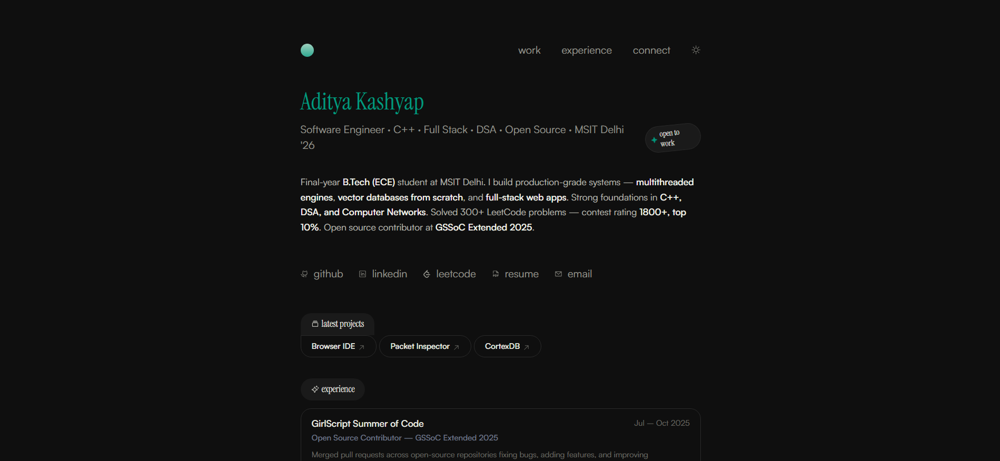

# Aditya Kashyap — Portfolio 2026

A modern, minimal, fully server-side rendered portfolio website built as a **Progressive Web App** with the [T3 Stack](https://create.t3.gg/).



## 👨‍💻 About

Final-year B.Tech (ECE) student at **Maharaja Surajmal Institute of Technology, Delhi**. Builds production-grade systems — multithreaded engines, vector databases from scratch, and full-stack web apps. Strong foundations in C++, DSA, and Computer Networks. 300+ LeetCode problems solved — contest rating **1800+, top 10%**.

## 🌟 Features

- **Progressive Web App** — installable on any device with native app-like experience
- **Dark / Light Mode** — toggle in navbar, persists via localStorage
- **Minimal Design** — calm cream background, serif typography, no gradients
- **Server-Side Rendering** — fully SSR for optimal performance and SEO
- **Contact Form** — Gmail-powered with rate limiting and thank-you emails
- **Skills Section** — grouped by Languages, Frontend/Backend, Databases, Core CS, Tools
- **Experience & Education** — displayed on homepage
- **Responsive** — works on desktop, tablet, and mobile

## 📄 Pages

| Route | Description |
|---|---|
| `/` | Homepage — hero, bio, projects, experience, skills, education |
| `/experience` | Full experience and open source contributions |
| `/connect` | Contact form with Gmail integration |

## 🚀 Projects Showcased

| Project | Stack | Description |
|---|---|---|
| **Browser IDE** | Next.js 15, TypeScript, WebContainers, MongoDB, Ollama | Full-stack browser IDE with Monaco Editor, in-browser Node.js execution, local LLM integration |
| **Packet Inspector** | C++17, POSIX Threads, TCP/IP, TLS | Multithreaded Deep Packet Inspection engine — parses PCAP, extracts TLS SNI, classifies HTTPS traffic |
| **CortexDB** | C++17, Python, HNSW, RAG, Ollama | Vector database from scratch with HNSW (same algorithm as Pinecone/Weaviate) + full RAG pipeline |

## 🛠️ Tech Stack

- **Framework** — [Next.js 15](https://nextjs.org) with App Router
- **Language** — TypeScript
- **Styling** — [Tailwind CSS](https://tailwindcss.com)
- **Icons** — Phosphor Icons
- **Email** — Nodemailer + Gmail SMTP + React Email templates
- **Validation** — Zod + T3 Env
- **PWA** — Web App Manifest + splash screens

## 🏁 Getting Started

**1. Clone the repo**
```bash
git clone https://github.com/Aditya24Kashyap/Portfolio_2026.git
cd Portfolio_2026
```

**2. Install dependencies**
```bash
npm install
```

**3. Set up environment variables**

Create a `.env.local` file in the root:
```
GMAIL_APP_ID=your-gmail@gmail.com
GMAIL_APP_PASSWORD=your-16-letter-app-password
EMAIL_TO=your-gmail@gmail.com
PROD_WEBSITE_URL=http://localhost:3000
```

To get a Gmail App Password:
1. Go to **myaccount.google.com/apppasswords**
2. Enable 2-Step Verification if not already on
3. Generate a new app password → copy the 16-character password
4. Paste it as `GMAIL_APP_PASSWORD` (no spaces)

**4. Run the dev server**
```bash
npm run dev
```

Open [http://localhost:3000](http://localhost:3000)

## 📦 Build for Production

```bash
npm run build
```

All pages should show green checkmarks. Then deploy.

## 🚀 Deploy on Vercel

1. Push to GitHub
2. Go to [vercel.com](https://vercel.com) → New Project → import `Portfolio_2026`
3. Add the same 4 environment variables in **Settings → Environment Variables**
4. Click Deploy

> Make sure to update `PROD_WEBSITE_URL` to your actual Vercel URL after first deploy.

## 📁 Project Structure

```
src/
├── app/                          # Next.js App Router pages
│   ├── page.tsx                  # Homepage
│   ├── experience/page.tsx       # Experience page
│   ├── connect/page.tsx          # Contact page
│   └── api/send-email/route.ts   # Email API route
├── components/
│   ├── homepage/
│   │   ├── bio.tsx               # Bio paragraph
│   │   ├── projects/             # Project chips with tooltips
│   │   ├── skills.tsx            # Grouped skills section
│   │   ├── experience-section.tsx # Experience on homepage
│   │   └── education-section.tsx  # Education on homepage
│   ├── header.tsx                # Navbar with dark mode toggle
│   └── ...
├── constants/
│   ├── projects.ts               # Project data
│   ├── experience.ts             # Experience data
│   ├── tools.tsx                 # Skills grouped by category
│   └── index.tsx                 # Social links
├── emails/                       # React Email templates
└── styles/globals.css            # Global styles + dark mode
```

## 📱 PWA Installation

**Mobile (iOS/Android):**
1. Open the site in your browser
2. Tap Share → "Add to Home Screen"

**Desktop (Chrome/Edge):**
1. Look for the install icon in the address bar
2. Click Install

## 📄 License

MIT — feel free to fork and customize for your own portfolio.

---

Built by [Aditya Kashyap](https://github.com/Aditya24Kashyap)
